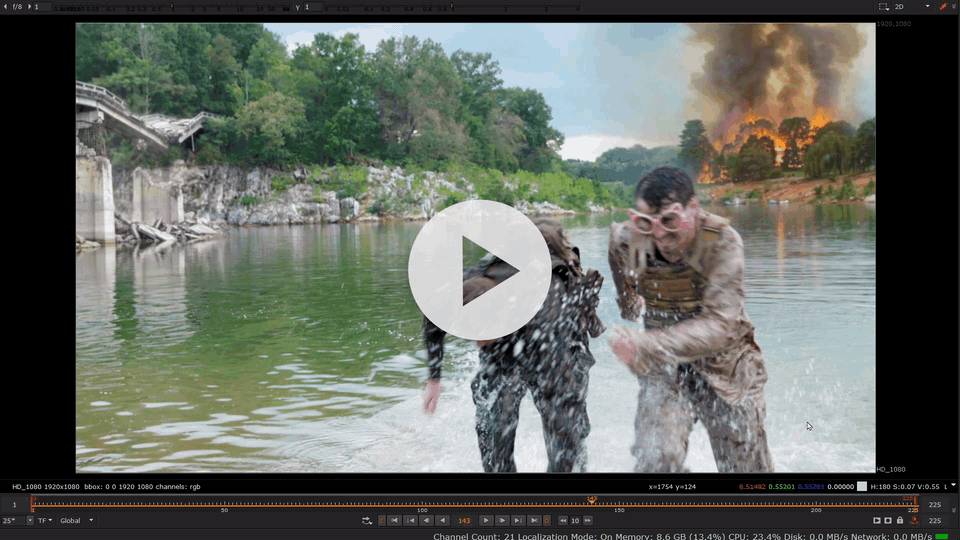

# nuke-fal-ai-tools

**fal.ai** nodes for [Foundry Nuke](https://www.foundry.com/products/nuke). Image, video, and 3D workflows from the node graph.

<a href="https://www.youtube.com/watch?v=nRTBxsMcXe0" title="Watch demo on YouTube">
  
</a>

**v1.0.1** early release. APIs and models may change. Full tool list: [CHANGELOG.md](CHANGELOG.md).

## Tools

16 groups under **Nodes → fal.ai**:

| Category | Tools |
|----------|--------|
| **Image** | Nano Banana 2, Qwen Image Max, GPT Image 2, Qwen Inpaint, Finegrain Eraser, BiRefNet v2, Depth Anything v2, Qwen Layered |
| **Video** | LTX 2.3, Seedance 2, Pika v2.2, Kling O3, Veo 3.1, ByteDance Upscaler, DreamActor v2 |
| **3D** | Hunyuan 3D |

## Quick start

1. Download the [latest release](https://github.com/JuusoKaari/nuke-fal-ai-tools/releases/latest) or `git clone`.
2. Add the folder with `init.py` to **`NUKE_PATH`**.
3. `py -3 -m pip install -r requirements-python3.txt`
4. Set **`FAL_KEY`** before launching Nuke.
5. Restart Nuke → **Nodes → fal.ai**.

Install details: [docs/INSTALL.md](docs/INSTALL.md) · Issues: [docs/troubleshooting.md](docs/troubleshooting.md)

## Requirements

- Nuke 8.0+ (tested on 11.3v6 and 17.0v2)
- System Python 3 with [`fal-client`](requirements-python3.txt) (`py -3` on Windows, `python3` elsewhere)
- ffmpeg and ffprobe on `PATH` for video tools
- fal.ai account (usage is billed to you)

## How it works

```text
Nuke Group  →  runner (in Nuke)  →  helper (system Python 3)  →  fal.ai
```

Runners pre-render inputs inside Nuke, call helpers via subprocess, then spawn Read or Geo nodes for results.

## Notes

- Each Execute call bills your fal.ai account.
- Set `FAL_KEY` in the environment.
- Output lands in `nuke_fal_temp/` and `nuke_fal_output/` next to your script (or system temp).
- Best-effort support via [GitHub issues](https://github.com/JuusoKaari/nuke-fal-ai-tools/issues). No warranty.

## License

[Mozilla Public License 2.0](LICENSE) (MPL 2.0).

## Links

- [Demo (YouTube)](https://www.youtube.com/watch?v=nRTBxsMcXe0)
- [Latest release](https://github.com/JuusoKaari/nuke-fal-ai-tools/releases/latest)
- [fal.ai](https://fal.ai/) (API keys)
