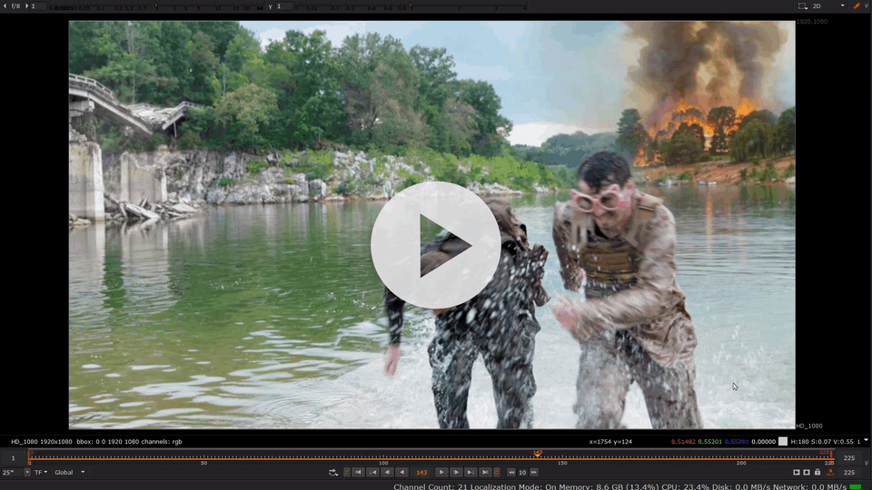

# nuke-fal-ai-tools

**fal.ai** nodes for [Foundry Nuke](https://www.foundry.com/products/nuke). Image, video, and 3D workflows from the node graph.

<a href="https://www.youtube.com/watch?v=nRTBxsMcXe0" title="Watch demo on YouTube">
  
</a>

**v1.0.2** early release. APIs and models may change. Full tool list: [CHANGELOG.md](CHANGELOG.md).

## Tools

21 groups under **Nodes -> fal.ai** (families with 2+ tools are submenus; singles stay flat; Utility last):

| Category | Tools |
|----------|--------|
| **Image** | GPT Image 2, Hunyuan World, Nano Banana 2, **Qwen** (Inpaint, Layered, Max Edit), **Utility** (BiRefNet still, Depth, Finegrain) |
| **Video** | DreamActor v2, Kling O3, **LTX** (2.3, 2.5 Pro), Pika v2.2, **Seedance** (2, 2.5), Veo 3.1, **Utility** (BiRefNet, ByteDance upscale) |
| **3D** | Hunyuan 3D |
| **Text** | **OpenRouter** (Describe image, Generate text) |

## Quick start

Ask Claude, Codex, or Cursor to set it up:

```text
Help me install this toolset on my Nuke: https://github.com/JuusoKaari/nuke-fal-ai-tools
```

Or do it yourself:

1. Download the [latest release](https://github.com/JuusoKaari/nuke-fal-ai-tools/releases/latest) or `git clone`.
2. Point Nuke at the install **root** (folder with `init.py`, not the inner `nuke/`):
   - Artists: add one line to `~/.nuke/init.py`:
     `nuke.pluginAddPath("/path/to/nuke-fal-ai-tools")`
   - Studios: add that same folder to **`NUKE_PATH`**.
3. `py -3 -m pip install -r requirements-python3.txt`
4. Set your API key (cascade: studio `FAL_KEY` -> **fal.ai -> Settings...** on this machine -> optional per-node **FAL** knob).
5. Restart Nuke -> **Nodes -> fal.ai** (Tab search: type `fal`).

Install details: [docs/INSTALL.md](docs/INSTALL.md) · Issues: [docs/troubleshooting.md](docs/troubleshooting.md)

## Requirements

- Nuke 8.0+ (tested on 11.3v6 and 17.0v2)
- System Python 3 with [`fal-client`](requirements-python3.txt) (`py -3` on Windows, `python3` elsewhere)
- ffmpeg and ffprobe on `PATH` for video tools
- fal.ai account (usage is billed to you)

## How it works

```text
Nuke Group  ->  runner (in Nuke)  ->  helper (system Python 3)  ->  fal.ai
```

Runners pre-render inputs inside Nuke, call helpers via subprocess, then spawn Read, Geo, or Text nodes for results.

## Notes

- Each Execute call bills your fal.ai account.
- API key cascade: studio-wide `FAL_KEY` -> local Settings (`~/.nuke-fal-ai/config.json`) -> per-node **FAL** knob.
- Output lands in `nuke_fal_temp/` and `nuke_fal_output/` next to your script (or system temp), plus a `.json` sidecar next to each primary result. Video tools default to a DWAB EXR sequence Read (MP4 kept on disk; toggle in **fal.ai -> Settings...**).
- Best-effort support via [GitHub issues](https://github.com/JuusoKaari/nuke-fal-ai-tools/issues). No warranty.

## License

[Mozilla Public License 2.0](LICENSE) (MPL 2.0).

## Links

- [Demo (YouTube)](https://www.youtube.com/watch?v=nRTBxsMcXe0)
- [Latest release](https://github.com/JuusoKaari/nuke-fal-ai-tools/releases/latest)
- [fal.ai](https://fal.ai/) (API keys)
